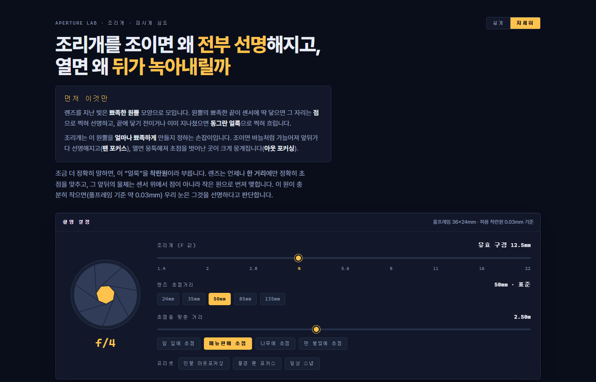
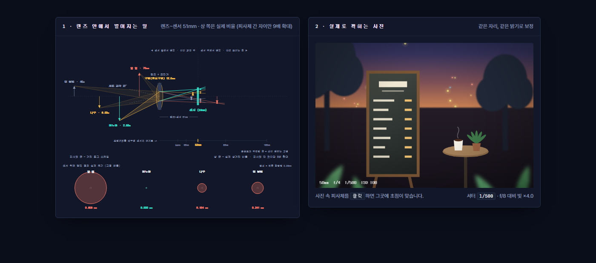
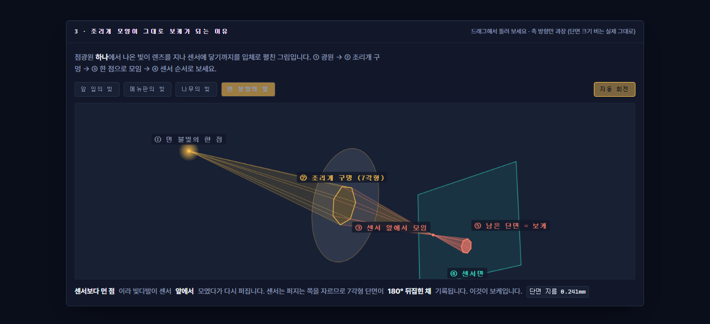

# 조리개 실험실 (Aperture Lab)

조리개를 직접 움직이며 **팬 포커스**와 **아웃 포커싱**이 생기는 이유를 광학 원리부터 사진 결과까지 한 화면에서 확인하는 인터랙티브 학습 페이지입니다.

### ▶ [q07k.github.io/camera-study](https://q07k.github.io/camera-study/)

의존성 없는 단일 HTML 파일이며, 빌드 과정이 없습니다.



## 무엇을 보여 주나

| 구획 | 내용 |
| --- | --- |
| 쉽게 / 자세히 | 첫 화면은 비유 한 문단으로 시작하고, 수치와 용어는 토글로 펼칩니다 |
| 조리개 다이얼 | 7날 아이리스가 f/1.4 ~ f/22에 따라 실제로 열리고 닫힙니다 |
| 렌즈 단면도 | 빛다발이 굴절되어 각기 다른 위치에 상을 맺는 과정. 초점거리를 바꾸면 **센서가 실제 상거리만큼 뒤로 물러나고** 화각이 좁아집니다 |
| 상이 뒤집히는 지점 | 피사체마다 상이 맺히는 위치를 화살표로 표시. 센서 앞에서 맺히는지 뒤에서 맺히는지가 구분됩니다 |
| 착란원 인셋 | 센서 위에 맺힌 점의 실제 크기를 고정 배율로 비교 (점선 = 허용 착란원 0.03mm) |
| 사진 시뮬레이션 | 같은 설정으로 찍은 결과. 피사체를 클릭하면 그 자리에 초점이 맞습니다 |
| 3D 광선다발 | 점광원에서 나온 빛다발이 조리개 다각형을 지나 센서를 자르는 입체. 드래그로 회전 |
| 심도 눈금자 | 로그 거리 축 위의 선명 구간, 과초점거리, 팬 포커스 판정 |

### 광학과 결과를 나란히

왼쪽에서 빛다발이 어디에 상을 맺는지 보고, 오른쪽에서 그 설정으로 실제로 어떤 사진이 나오는지 확인합니다.
메뉴판의 분필 글씨는 초점이 나가는 순간 읽을 수 없게 되므로, 선명도를 눈으로 판정할 수 있습니다.



### 보케가 조리개 모양인 이유

점광원에서 나온 빛은 **원뿔**이고, 조리개가 그 원뿔의 **단면 모양**을 정합니다.
센서가 원뿔의 꼭짓점을 비켜 자를수록 조리개 모양이 크게 남습니다 — 이것이 보케입니다.
아래는 초점보다 먼 점이라 센서 앞에서 모였다가 다시 퍼지고, 그래서 7각형 단면이 180° 뒤집힌 채 기록되는 상황입니다.



배경 점광원의 보케는 조리개 날개 모양을 그대로 따라가므로, 활짝 열면 원형이고 조이면 칠각형이 됩니다.

## 계산 근거

- 얇은 렌즈 근사, 풀프레임 36×24mm, 허용 착란원 0.03mm
- 착란원 지름 `c = (f² / N) × |S − D| / (S × (D − f))`
- 과초점거리 `H = f² / (N × c) + f`
- 근점 `S(H − f) / (H + S − 2f)`, 원점 `S(H − f) / (H − S)` (S ≥ H 이면 무한대)

회절과 렌즈 수차는 반영하지 않았습니다. 실제로는 f/16 이상에서 회절에 의한 해상력 저하가 나타납니다.
단면도의 상 쪽은 **실제 상거리에 비례**해 그립니다. 조리개 지름에도 같은 배율을 쓰므로, F값이 같으면 초점거리가 달라도 광선 원뿔의 각도가 같게 나옵니다
(= F값이 밝기의 기준인 이유). 다만 피사체 사이의 상거리 차이는 0.1mm 수준이라 그 **차이만** 따로 확대하며, 몇 배 확대했는지는 화면에 표시합니다.
망원으로 갈수록 확대 배율이 1배에 가까워져, 135mm에서는 과장 없이 실제 비율로 그려집니다. 피사체 쪽 가로축은 로그 스케일입니다.
3D 뷰도 같은 이유로 축 방향을 과장했습니다. 다만 단면 지름 / 조리개 지름 = `|v − vF| / v` 라는 비를 일정 배로만 키웠기 때문에,
피사체 사이의 단면 크기 비와 조리개에 따른 크기 비는 실제와 같습니다. 센서면은 상이 맺히는 평면의 기준으로만 그렸고 36×24mm 실제 크기가 아닙니다.
전경 잎은 초점거리를 바꿔도 프레이밍이 유지되도록 화면 가장자리에 고정 배치했습니다(촬영 위치를 다시 잡은 셈). 흐림 정도는 0.7m 기준으로 계산합니다.

## 로컬에서 열기

```bash
start index.html
```
